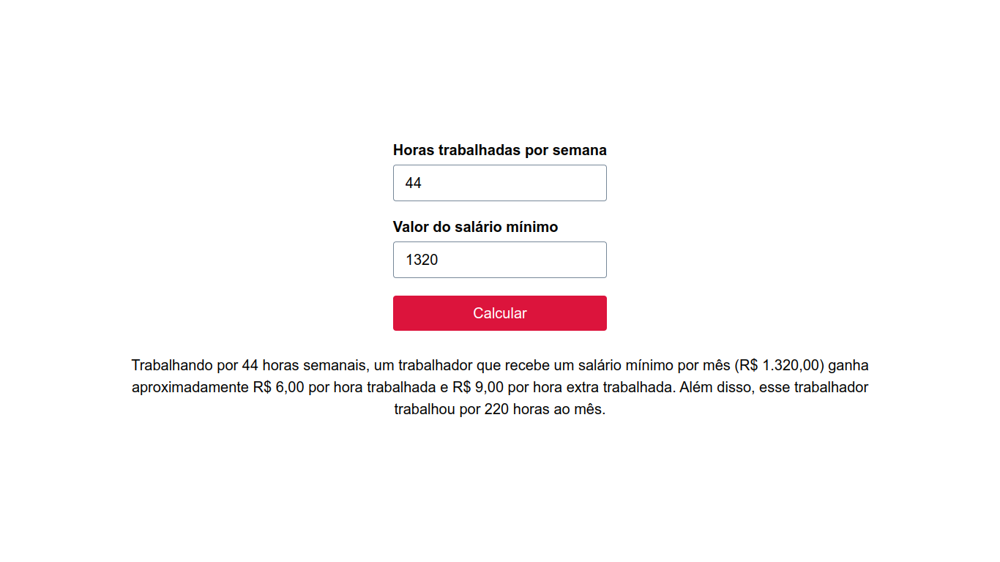

# salary-calculator

## Sumário

- [salary-calculator](#salary-calculator)
  - [Sumário](#sumário)
  - [Motivação](#motivação)
  - [Pilha de tecnologia](#pilha-de-tecnologia)
  - [Galeria](#galeria)
  - [Como rodar](#como-rodar)
    - [Pré-requisitos](#pré-requisitos)
    - [Passo a passo](#passo-a-passo)

## Motivação

Este repositório contém uma suíte de testes e uma página web desenvolvida para validar a aplicação que calcula o salário a receber baseado no número de horas trabalhadas, valor do salário mínimo e número de horas extras trabalhadas. A suíte de testes garante que todas as entradas e variáveis são validadas corretamente. Já na página web, é possível preencher os valores necessários e obter o resultado do cálculo do salário a receber. O cálculo segue as seguintes regras:

- A hora trabalhada vale valor do salário mínimo/total de horas mensais (normalmente é 44 horas semanais);
- A hora extra vale a 150% da hora trabalhada;
- O salário bruto equivale ao número de horas trabalhadas multiplicado pelo valor da hora trabalhada;
- A quantia a receber pelas horas extras equivale ao número de horas extras trabalhadas multiplicado pelo valor da hora extra;
- O salário a receber equivale ao salário bruto mais a quantia a receber pelas horas extras.

Este foi o primeiro repositório de código apresentado no [Curso Superior de TSI do IFMS](https://www.ifms.edu.br/campi/campus-aquidauana/cursos/graduacao/sistemas-para-internet/sistemas-para-internet) como requisito para obtenção da nota parcial das atividades da unidade curricular Engenharia de Software II.

## Pilha de tecnologia

| Papel | Tecnologia |
|-|-|
| Ambiente de execução | [Node](https://nodejs.org/en) |
| Linguagem de programação | [JavaScript](https://developer.mozilla.org/pt-BR/docs/Web/JavaScript) |
| Framework de teste | [Jasmine](https://jasmine.github.io/) |

## Galeria



## Como rodar

### Pré-requisitos

- [Node](https://nodejs.org/en/download/);
- [Yarn](https://yarnpkg.com/) (opcional).

### Passo a passo

1. Clone o repositório de código em sua máquina;

2. Abra um shell de comando de sua preferência (prompt de comando, PowerShell, terminal _etc_.);

3. Instale as dependências do projeto através do seguinte comando:

```console
$ npm install
```

Caso esteja utilizando o gerenciador de pacotes Yarn, execute o seguinte comando como alternativa:

```console
$ yarn
```

4. Execute o seguinte comando para iniciar o app:

Para npm:

```console
$ npm run start
```

Para Yarn:

```console
$ yarn start
```

5. Para executar a suíte de testes confeccionada para esta atividade, execute o seguinte comando:

Para npm:

```console
$ npm run test
```

Para Yarn:

```console
$ yarn test
```